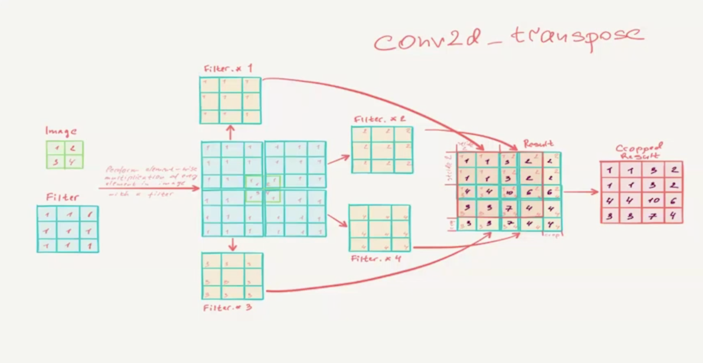
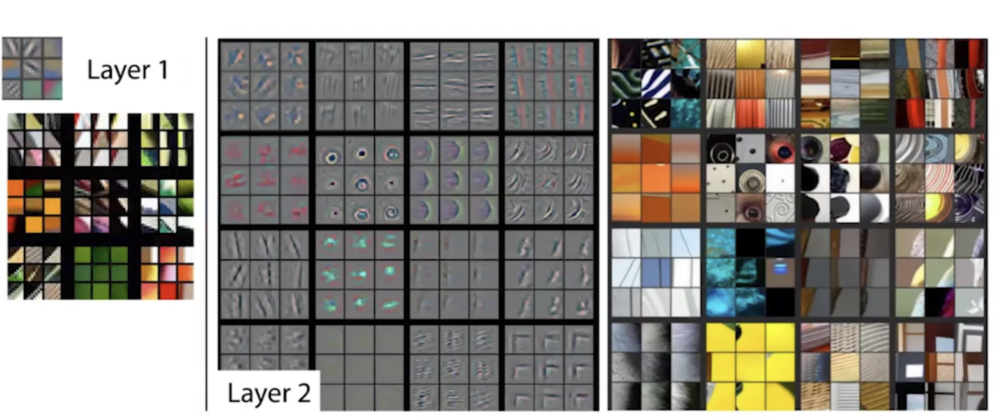
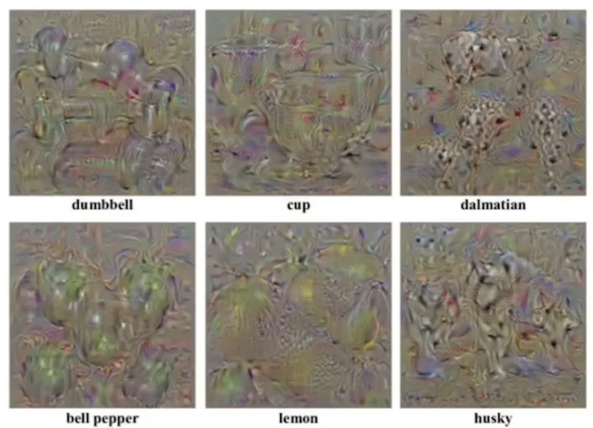
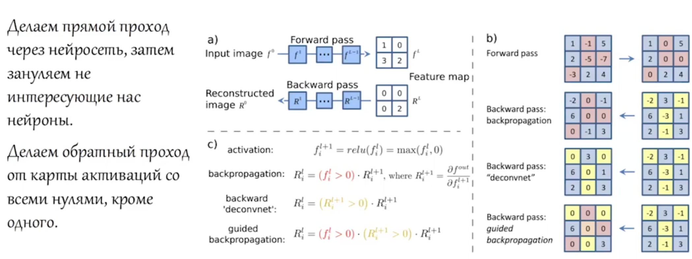
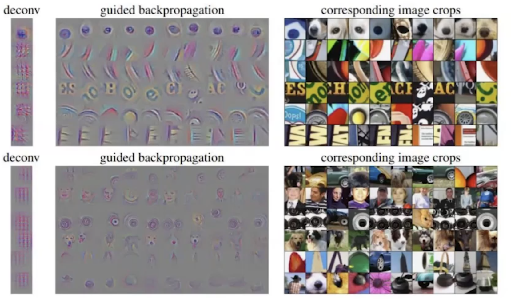

# Интерпретация Нейросетей (Lecture 4).

## 1. Методы интерпретации.

### 1.1. Свойства методов.

Expressive Power - насколько высокую возможность детализации имеет структура того,
что является "обьяснением" ответа модели. Например, в Reasoning моделях просят
LLM-ку порассуждать перед выдачей самого ответа - здесь обьяснение является
текстом, что имеет высокий Expressive Power.

Translucency - как много информации требуется методу о внутренностях модели.

Portability - универсальность метода к разным архитектурам.

Algorithmic Complexity - сложность метода.

### 1.2. Свойства отдельных обьяснений.

Accuracy - точность обьяснений на новых примерах.

Fidelity - обьяснимость результата black-box модели.

Consistency - близость обьяснений двух схожих моделей на одной
задаче с похожими результатами.

Stability - схожесть обьяснений на двух похожих примерах.

Comprehensibility - понятность человеку.

Certainty - использует ли обьяснение уверенность модели в ответах.

## 2. CV.

### 2.1. Receptive Field.

Прогнать ход до $i$-ого слоя свертки, взяли несколько чисел по топу значения активации.
Имея представление о receptive field, бэктрекаемся до входного изображения. Если Receptive
Field - уже вся картинка (что редко бывает), то никакой инфы не получим. Однако, если
Receptive Field - лишь какой-то регион, то поймем что именно такой регион привел к
рассмотренной активации.

### 2.2. Deconvolutional Network.

Используем обратную оперцию к свертке, `conv2d_transpose`.

Это лишь некоторая аппроксимация обратной к свертке операции. Именно в этом подходе,
ядро не обучаемое, то есть мы детерменированным способом восстанавливаем Receptive Field
с потерями информации, чтобы понять на что именно смотрит наш слой при активациях. На
картинке серым - результат DeconvNet-а, слева - патчи из предыдущего раздела 2.1.:

Также можно развернуть MaxPooling. Тут нужно будет делать так: на каждый обычный MaxPooling
будет ровно один InvMaxPooling, причем размер выхода первого должен быть равен размеру входа
второго. В MaxPooling в каждом регионе (стандартно это 2x2 квадрат) позицию, где нашли
максимальный элемент. В InvMaxPooling мы создаем матрицу нулей, и в каждом регионе в позиции,
которую запомнили (где был максимальный элемент региона), кладем число из входа.

Однако, операцию `conv2d_transpose` **можно сделать обучаемой**, что как раз используется
в автоэнкодерах.

### 2.3. Gradient Based.

Возьмем предобученную нейросеть, картинку заполняем случайным шумом и говорим, что это какой-то
определенный класс. Заморозим все слои, и будем "обучать" нашу картинку (которая изначально
просто шум) максимизировать заранее выбранный класс.

### 2.4. Guided Backpropagation.

Берем обученную модель и фиксируем класс, замораживаем все слои. Рассмотрим слои активации
ReLU. На обычном backpropagation, когда считаем градиенты, то в позициях где ReLU что-то занулил,
также зануляем градиент. А давайте теперь помимо этого, занулять не только те градиенты,
для которых ReLU занулял активацию, а еще и занулять все отрицательные градиенты:

### 2.5. Class Activation Mapping (CAM).

Смотрим, какие части изображения активируют соответствующий нейрон (как в 2.1.). Умножаем $W_i$
на активации $a_i$, затем все складываем по всем слоям $i$.

## 3. NLP.

### 3.1. Интерпретируемые эмбеддинги.

Вспоминаем Word2Vec - там $king - man + woman \approx queen$.

### 3.2. RNN-like.

RNN - по сути такая же линейная сетка, поэтому к ней относятся все упомянутые методы
(перемножить матрицы, глянуть Receptive Field от активаций). LSTM и GRU также легко
интерпретируются с точки зрения архитектуры.

Так как фичи RNN-like архитектуры - скорее эмбеддинги, следовательно, интерпретируемость
эмбеддингов здесь играет ключевую роль.

### 3.3. Attention & Transformer.

У нас явно есть attention scores, то есть значимость $i$-ого токена для $j$-ого. На каждом
шаге токен агрегирует в себе информацию нескольких других токенов с весами. Эту цепочку также
можно раскатить назад по MultiHead слоям.

