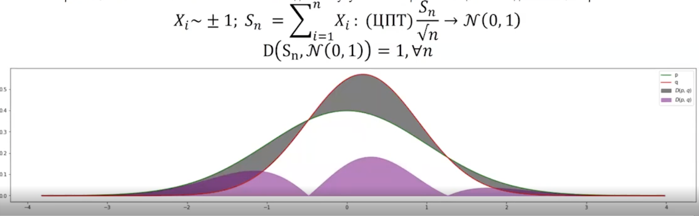
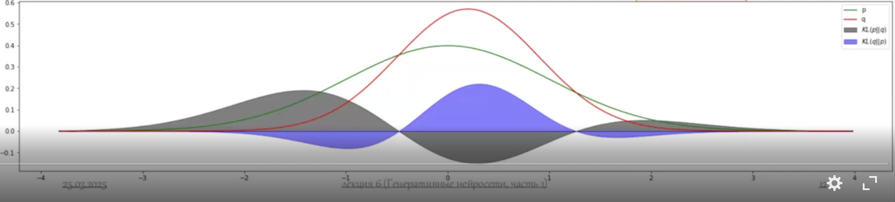
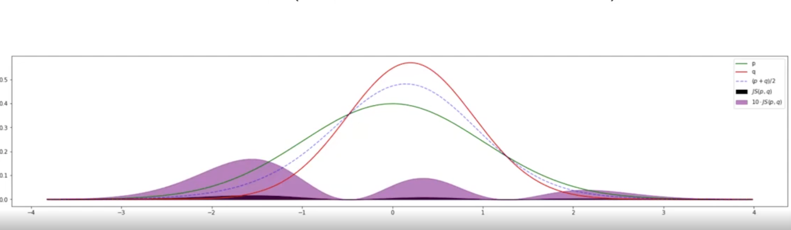
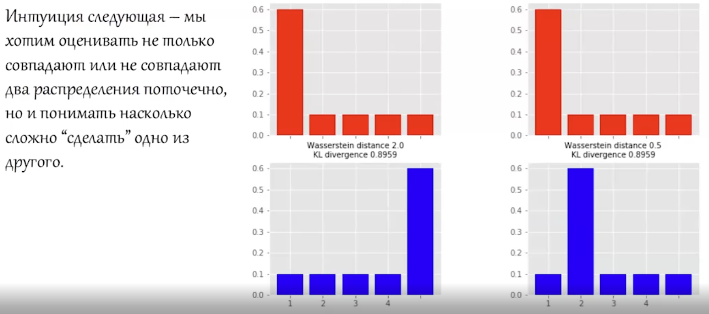
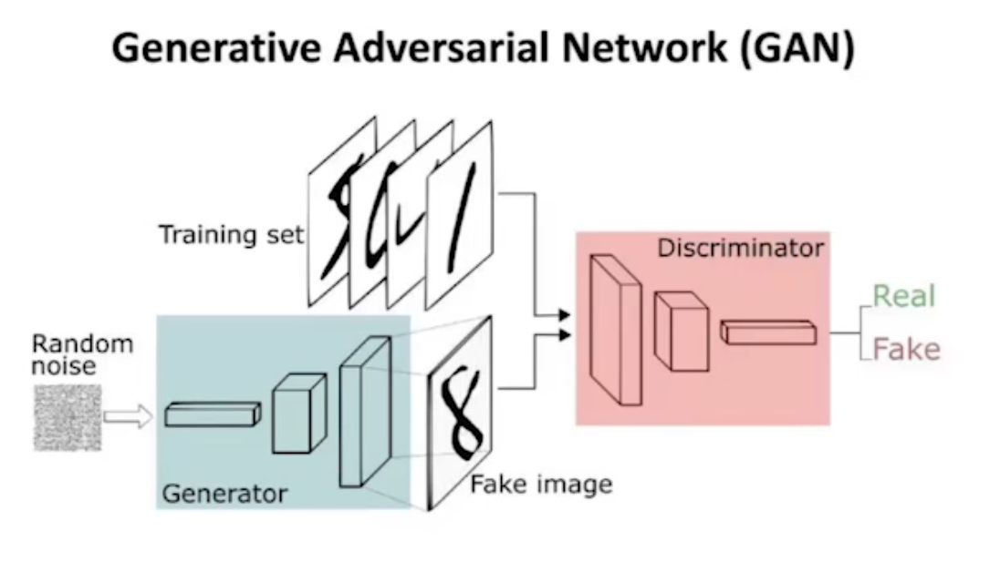

# Generative Models, part 1 (Lecture 5).

План лекции:
* Генеративные?
* Автоэнкодеры
* GANs

## 1. Генеративные?

### 1.1. Отличия от других видов задач.

* До этого решали задачи выучивания преобразования "входные данные" -> "предсказание".
* Что если мы хотим не предсказать какой-то обьект на данных, а создать новые элементы данных?
* Как создать что-то из ничего?
* Как проверять качество генерации?

### 1.2. Постановка задачи.

Имеем датасет ${x_i} \in X \sim p_{true}(x)$ - истинное вероятностное распределение над данными.

Задача - найти вероятностное распределене $p_{data}(x)$, максимально близкое к $p_{true}(x)$. Не
обязательно знать $p_{data}$, достаточно уметь из него сэмплировать.

Пусть $p_{true}(x) = p(x); p_{data}(x) = q_{\theta}(x)$ - нейросеть, параметризованная своими параметрами
$\theta$.

Не имеем доступа к истинному распределению $p$, но имеем к его эмпирической оценке $\hat{p}(x)|X$.

Задача обучения - уменьшить расстояние между распределениями $\hat{p}$ и $q_\theta$.

##### Какие задачи можно решать на практике?

LLM - формально, не генерация, а авторегрессионная потокенная классификация.

* Генерация изображений (unconditional, conditional).
* Синтез звука.
* Генерация структур.
* 3D анимация.
* Inpainting (восстановление куска изображения). Такая штука используется в фотошопах для удаления -
вырезал обьект по границе, дорисовал картинку.

### 1.3. Сравнение распределений.

Исходя из задачи, нужно уметь сравнивать распределения.

#### 1.3.1. Total Variation Distance.

$$D(p, q) = \int |p(x) - q(x)|dx$$

Хорошая, но слишком сильная - может не давать улучшения, так как нужна очень сильная сходимость.
Того же ЦПТ может не хватать - а это наш основной инструмент.

#### 1.3.2. KL Divergence.

Дивергенция Кульбака-Лейблера.

$$KL(p || q) = \int p(x)\log\frac{p(x)}{q(x)}dx$$

* Не симметрична.
* Не ограничена.
* Представляется в виду суммы энтропии $p$ и кросс-энтропии:

$$KL(p || q) = H(p, q) - H(p)$$

* При оптимизации по $q$, энтропию $H(p)$ можно не считать, так как она от $\theta$ не зависит.

##### Детали.

$KL(p || q_\theta)$ - избегает $q_\theta(x) = 0$ где $p(x) > 0$ (логично, если смотреть на логарифм
в формуле). Поэтому, при обучении точно накроем $p$, но разность в точках распределений уже хуже
отражена. Такая условная "верхняя оценка на $p$". Будем вначале покрывать все, затем
понемногу сжиматься.

$KL(q_\theta || p)$ - форсит $q_\theta(x) = 0$ где-то, даже если $p(x) > 0$. Так как $p(x)$ теперь
стоит в знаменателе логарифма, для маленьких значений $p(x)$ нужно занулять логарифм и через
$q_\theta(x)$, так как предел $x\log x$ равен нулю при нулевом $x$. Следовательно,
такая дивергенция будет форсировать узкое распределение над модой $p$, то есть генерировать
мы будем из основной массы $p$, но разнообразие $q_\theta$ будет слабой. Такая условная
"нижняя оценка на $p(x)$". Будем покрывать вначале только очень ограниченную область, и постепенно
расширяться.

Проблема KL. Если у нас $p$ это сумма гауссиан в разных центрах, то все плохо. Первый вариант покроет
все но плохо, так что частые точки (пересечения гауссиан) будут почти занулены. Второй покроет только
одну какую-то гауссиану. Следовательно, непонятно что делать с мультимодальными данными.

#### 1.3.3. JS Divergence.

Дивергенция Йенсена-Шеннона.

$$JS(p, q) = \frac{1}{2}\left(KL\left(p || \frac{p + q}{2}\right) + KL\left(q || \frac{p + q}{2}\right)\right)$$

* Симметрична.
* Неотрицательна и ограничена: $0 \leq JS(p, q) \leq \ln 2$.
* $\sqrt{JS(p, q)}$ - метрика в пространстве распределений.

#### 1.3.4. Wasserstein Distance.

Минимальная работа, требующаяся, чтобы получить из одного распределения другое. Так же известна,
как Earth Mover's Distance (EMD).

Если $p_1$ не пересекается с $q$, $p_2$ не пересекается с $q$ (скажем, обрезанные гауссианы), то
$KL(p_1, q) = KL(p_2, q)$ вне зависимости от того, кто из $p_i$ по факту ближе. Поэтому, если
мы находимся в $p_i$, то ни JS, ни KL не дают нам направления, куда двигаться. Так как данные
многомерные, то очень велика вероятность, что мы начнем очень далеко от $q$. Поэтому, хоть
большой lr, тысячи эпох - никуда не сойдемся. Как костыль, можно для начала брать очень большую
дисперсию (идея в диффузионках), но пока остановимся на том, что хотим считать честное расстояние.

**Идея EMD**: составим функцию $\gamma(x_1, x_2), \gamma(x_1, x_2) \geq 0$, которая будет говорить,
сколько работы $\gamma(x_1, x_2)dx_1dx_2$ нужно совершить, чтобы перенести вероятностную массу
(отсюда earth) из интервала $(x_1, x_1 + dx_1)$ в интервал $(x_2, x_2 + dx_2)$. Имеется ввиду,
что $x_1$ - точка под $p$, $x_2$ - точка под $q$.

$$EMD(p, q) = \inf_{\gamma \in \pi}\mathbb{E}_{x_1, x_2 \sim \gamma(x_1, x_2)}|| x_1 - x_2 ||$$

Как все это считать? Kantorovich-Rubinstein duality:

$$EMD(p, q) = W(p, q) = \sup_{f \in Lip_1}\left(\mathbb{E}_{x \sim p}f(x) - \mathbb{E}_{y \sim q}f(y)\right)$$

$$k \geq 0; f \in Lip_k \Leftrightarrow || f ||_L \leq k \Leftrightarrow \forall x || \nabla f(x) || \leq k$$

Липшицевость можем гарантировать на уровне модели, а как строить "план переноса" - вообще не понятно.

### 1.4. Метрики генерации.

#### 1.4.1. Inception Score.

Произошел от Inception Net. Общий подход требует нейросетку, обученную под ваш домен.

Проверяет две вещи:
1. Разнообразие данных.
2. Сфокусированность (конкретность) по отношению к модам.

Возьмем предобученную модель-классификатор на подобных данных - нейросеть $d(x) \in [0, 1]^K$.

В идеале, хотим, чтобы все классы были хорошо представлены (разнообразие) и каждый отдельный
обьект имел четкий класс (конкретность).

Тогда
1. $m = \mathbb{E}_{y \sim q_\theta}d(y) \approx U_{\{1, ..., K\}}$.
2. $d(y) \approx \delta_{\{1, ..., K\}}(t)$.

Эту пару условий можно записать как оптимизационную задачу:

$$IS(q_\theta) = \mathbb{E}_{y \sim q_\theta}(KL(d(y) || m)) \mapsto \max$$

Но лучше использовать просто как метрику.

#### 1.4.2. Frechet Inception Distance.

Хотим сравнить распределение сгенерированных данных $Y$ с реальными $X$. Также возьмем какую-то
предобученную модель в нашем домене, получим ее предсказания (можно даже взять
активации после какого-то слоя) как $d(X), d(Y)$.

Существует формула Frechet Distance - расстояние между двумя нормальными
распределениями:

$$d_F\left(\mathcal{N}(\mu_1, \Sigma_1), \mathcal{N}(\mu_2, \Sigma_2)\right) = ||\mu_1 - \mu_2||_2^2 + tr\left(
\Sigma_1 + \Sigma_2 - 2\left(\Sigma_1^{1/2}\Sigma_2\Sigma_1^{1/2}\right)\right)$$

Тогда наша метрика - просто $d_F\left(\mathcal{N}(\mu_{d(X)}, \Sigma_{d(X)}), \mathcal{N}(\mu_{d(Y)}, \Sigma_{d(Y)})\right)$.

Предположение о нормальности, конечно, проблема, но на практике и так хорошо.

#### 1.4.3. LPIPS.

Learned Perceptual Image Patch Similarity.

Берем также предобученную нейросеть и смотрим на расстояние между активациями со всех слоев (L2)
для пары обьектов.

Редко используется, но в индивидуальных случаях полезно. Проверить, что сетка не просто запоминает картинки.

### 1.5. Общий подход.

Как сделать генеративную модель? Нужен процесс сэмплирования $\implies$ некая случайность. Будем
сэмплировать шум $z$ (это и есть seed) и рассматривать модель как преобразование $z \mapsto p_{true}$.

## 2. Autoencoders.

### 2.1. Интуиция и архитектура.

Давайте обучать не только $z \mapsto p_{true}$, а еще и $p_{true} \mapsto z$? То есть будем пытаться
восстановить изначальный обьект полностью (например, попиксельный лосс с картинкой).

Имея кодировку $g_\phi(z|x)$ и декодировку $f_\theta(x|z)$, задача реконструкции:

$$x = x' \sim f(x'|z')|_{z' \sim g_\phi(z|x)}$$

Тогда в качестве лосса будет ровно ошибка реконструкции:

$$\mathcal{L}(f, g|X) = \mathbb{E}_{x \sim \hat{p}} || x - f_\theta(g_\phi(x)) || _2^2$$

$\hat{p}$ как эмпирическая оценка $p_{true}$.

Пусть латентное пространство $z$ получается после активации. Тогда после обучения, можем использовать
только decoder, а $z$ сэмплировать.

### 2.2. Особенности.

Семейство автоэнкодеров:

* Быстрое сэмплирование. 
* Высокое разнообразие генерации.
* Низкое качество отдельных примеров.

Проблема автоэнкодера - постоянно размытые изображения. Более того, не гарантировано, что любой латентный
вектор мог бы получиться с помощью кодирования входных данных.

### 2.3. Модификации.

Никто не использует AE вообще никогда.

VAE (Variational Auto Encoder) - вместо обучения непосредственных векторов $z$ латентного
пространства, будем обучать $\mu_z$ и $\Sigma_z = diag(\sigma_1, ..., \sigma_k)$.

Процесс прохода через нейросеть такое:

1. Берем обьект $x \in X$.
2. Кодируем $[\mu, \Sigma] = g(x)$.
3. Сэмплируем вектор $z \in \mathcal{N}(\mu, \Sigma)$.
4. Декодируем $x' = f(z)$.

Важно: вместо того, чтобы задать точку $z$ (как в AE) напрямую, мы выучиваем
сразу распределения (то есть $\mu$ и $\Sigma$). Теперь мы хотим уметь конструировать обьект
не по одной точке, а то любой точке из целового распределения.

Следовательно, итоговый лосс складывается из ошибки реконструкции и KL-дивергенции между
распределениями.

$$\mathcal{L}_{MSE}(f, g|X) = \mathbb{E}_{x \sim \hat{p}}||x - f_\theta(g_\phi(x)) ||_2^2$$

$$\mathcal{L}_{KL}(f, g|X) = D_{KL}\left(\mathcal{N}(\mu_z, \Sigma_z), \mathcal{N}(0, 1)\right) =
-\frac{1}{2\sum_{i=1}^{N}} 1 + \log \sigma_{z_i} - \mu_{z_i}^2 - \sigma_{z_i}$$

И тогда ELBO лосс:

$$\mathcal{L}_{VAE} = \mathcal{L}_{KL} + \mathcal{L}_{MSE}$$

Второй лосс нужен, чтобы мы после обучения могли брать $\mathcal{N}(0, 1)$.

Сэмплирование делаем через **reparametrization trick**, чтбы были нормальные градиенты через
параметры распределения: вместо сэмплирования из $\mathcal{N}(\mu_z, \Sigma_z)$,
сэмплируем из $\mathcal{N}(0, 1)$.

Почему в $D_{KL}$ порядок именно такой? Открыть формулу и посмотреть выкладки, что были выше для $KL$.
В порядке $D_{KL}$  краевые значения $\mathcal{N}(0, 1)$ модель будет просто занулять,
и охватывать моду. Тогда мы будем пытаться подобрать такое $p$, которое будет внутри $q$ (которое в
нашем случае $\mathcal{N}(0, 1)$). Тогда основная вероятностная масса как раз таки хорошо покрыта.
И тогда понятно, что если при генерации засэмплировать латентный вектор из $\mathcal{N}(0, 1)$ и
попасть далеко от центра, то могут возникнуть некоторые артефакты, более грязное изображение.

**Это работает?** По факту говоря, decoder-у нужно научиться реконструировать изображение из
точки распределения, которое задал encoder. Ну в таком случае, если encoder выдает на каждую
картинку константные параметры (а KL-лосс это хочет), то это просто невозможно.
Значит, encoder должен уметь выдавать
разные гауссианы (разные ~ не сильно пересекающиеся), чтобы decoder мог их различать
по входной точке, и тогда еще можно поверить что он выучит реконструкцию лишь по точке распределения.
Следовательно, можно заключить, что два лосса противоположны друг другу в смысле оптимизации - 
KL заставляет encoder выдавать одно распределение, а MSE заставляет выдавать непересекающиеся,
чтобы decoder что-то умел различать. Но на самом деле, это не совсем так, потому что
KL форсирует "охватывать моду $\mathcal{N}(0, 1)$" (в таком порядке аргументов), а тогда
случай маленьких непересекающихся гауссиан подходит для того, чтобы оба лосса сразу
минимизировались.

## 3. Генеративно Состязательные Сети (GAN).

### 3.1. Интуиция и архитектура.

Пусть $G_\theta(z)$ - генератор (по входному шуму генерирует данные),  $D_\phi(x)$ -
дискриминатор (бинарная классификация - реальные/сгенерированные данные).

1 раз обучаем генератор, затем $k$ раз дискриминатор.

Классический GAN обучается на KL.

Обучение тяжелое и нестабильное, так как если одна модель становится сильнее другой,
то она умеет полностью разделять два распределения, а как было ранее рассмотрено для
KL, если $p$ и $q$ не пересекаются, то дельта-движение в любую сторону не уменьшает лосс.

Лосс генератора:

$$\min_\theta \mathbb{E}_{z \sim \mathcal{N}(0, 1)}\log \left(1 - D_\phi(G_\theta(z))\right)$$

Лосс дискриминатра:

$$\max_\phi \mathbb{E}_{x \sim p}\log D_\phi(x) + \mathbb{E}_{\hat{x} \sim q_\theta}\log(1 - D_\phi(\hat{x}))$$

Можно показать, что такие лоссы - оптимизация Jensen-Shannon divergence:

$$\arg \min_\theta \max_\phi \mathbb{E}_{x \sim p, \hat{x} \sim q_\theta}V(D_\phi(x), D_\phi(\hat{x}))$$

где $V$ - расстояние (JS в данном случае).

### 3.2. Особенности.

Семейство GAN-ов:
* Быстрое сэмплирование.
* Низкое разнообразие генерации + mode collapse.
* Высокое качество отдельных примеров.

### 3.3. Модификации.

JS, как и KL, не сможет обучаться на непересекающихся распределениях. Хотим заменить на Wasserstein Distance.

$$\sup_{D \sim Lip_1}\left(\mathbb{E}_{x \sim p}D_\phi(x) - \mathbb{E}_{\hat{x} \sim q_\theta}D_\phi(\hat{x}\right)$$

Однако, это не простая процедура, так как требуется не просто заменить лосс, а еще обеспечить условие
$k$-Липшицевость дискриминатора. Варианты:

* Gradient clipping: $w = clip(w, -c, c)$ - "имитируем Липшицевость", формально то нет никаких гарантий, что
она есть. Менее экспрессивный дискриминатор.
* Gradient penalty: $GP = \lambda\mathbb{E}_{\hat{x} \sim q_\theta}
\left(||\nabla_{\hat{x}}D_\phi(\hat{x})|| - 1\right)^2$ - строгой $1$-Липшицевости нет, только стремимся,
соответственно, не обязательно теперь это эквивалентные задачи (выполнение KR duality), но лучше. В отличии
от предыдущего пункта, тут проверяем настоящую Липшицевость.
* Spectral normalization: $W_{SN} = \frac{w}{\sigma(w)}; \sigma(w) = \max_{h: h \neq 0}\frac{|| Wh||_2}{||h||_2}$
