# Generative Models, part 2 (Lecture 6).

## 1. Нормализующие потоки (NF).

### 1.1. Интуиция.

Что, если мы будем преобразовывать не отдельные обьекты, а целиком
пространство данных.

Пусть есть обратимая функция $f: \mathbb{R}^n \mapsto
\mathbb{R}^n$, такая, что $x \sim p(x)
\implies f(x) = z \sim q(z)$. Здесь $p$ - настоящее (мы приближаем его эмпирическим)
распределение над данными, из которого хотим уметь сэмплировать, а $q(z)$ -
какое-то распределение, удобное нам, также над $R^d$. Например,
многомерное нормальное или равномерное.

Найти одно общее $f$ трудно, поэтому давайте скажем, что $f = f_1 \circ ... \circ f_K$.
Тогда если сможем найти обратимые и дифференцируемые $f_i$, то $f$ будет также обратима
и дифференцируема. Достаточно будет сэмплировать из нами же заданного $q(z)$ и получать
$f^{-1}(z) \sim p$.

### 1.2. Архитектура

$f_i$ - наша нейросеть (еще можно $f_i^{-1}$). Будем максимизировать правдоподобие
обучающей выборки $X$ относительно $\tilde{p} = g_1 \circ ... g_K; g_i = f_i^{-1}$.

Главные вопросы:
1. Как считать правдоподобие?
2. Как получить нейросеть с необходимыми ограниченями?

#### 1. Как считать правдоподобие?

Используем формулу замены переменной: пусть $x \sim p(x), z \sim q(z), f: \mathbb{R}^n \mapsto
\mathbb{R}^n, f(x) = z$, тогда:

$$p(x) = q(f(x) \cdot \left|\det \frac{\partial f}{\partial x}\right|$$

Якобиан требует $O(n^3)$, непосильно для обучения.

Правдоподобие для обьектов $\{x_i\}_{i=1}^m$:

$$
\begin{array}{c}
L(X|p) & = \\
-\frac{1}{m}\sum_{i=1}^{m}\log p(x_i) & = \\
-\frac{1}{m}\sum_{i=1}^{m}
\left(
\log q(f(x_i)) + 
\sum_{j=1}^{K}\log \left|\det \frac{\partial f_j(x_i)}{\partial x_i}\right| 
\right) & = \\
-\frac{1}{m}\sum_{i=1}^{m}
\left(
\log q(f(x_i)) + 
\log \prod_{j=1}^{K}\left|\det \frac{\partial f_j(x_i)}{\partial x_i}\right| 
\right) & = \\
-\frac{1}{m}\sum_{i=1}^{m}
\left(
\log q(f(x_i)) + 
\left|\det \frac{\partial f(x_i)}{\partial x_i}\right| 
\right)
\end{array}
$$

В качестве $f$ будем брать такие функции, для которых уже математически/алгоритмически
формула Якобиана известна.

#### 2. Как получить нейросеть с необходимыми ограниченями?

Нам нужно, чтобы функция была:
* Обратимой (для генерации)
* Дифференцируемой (для формулы замены переменной, т.е. Якобиана)
* Легко считался Якобиан (для лосса)

На этом шаге идея нормализующих потоков обобщена, и для конкретной реализации
нужно выбрать семейство хорошо изученных функций, удовлетворяющих требованиям.

Рассмотрим Planar & Radial потоки.

### 1.3. Виды.

#### 1.3.1. Planar.

$$x = f^{-1}(z) = z + uh(w^Tz + b)$$

$$\det\frac{\partial f^{-1}(z)}{\partial z} = 1 + u^Th'(w^Tz + b)w$$

где $u, w \in \mathbb{R}^n, b \in \mathbb{R}, h, h'$ - element-wise нелинейность
(например, для tanh, для обратимости требуется $w^Tu > -1$).

Это уже оптимизация с ограничениями, но обычно просто в лосс добавляют компоненту, сильно
штрафующую за выход из ограничения. Например, в данном случае, если справа от $-1$, то ноль,
а при переходе к $-1$ влево - резкое возрастание к $+\infty$.

Такая $f$ просто выделяет линию определенной ширины в пространстве и в ней все зануляет.
По сути, разрезает пространство на части (которые перевзвешиваются).

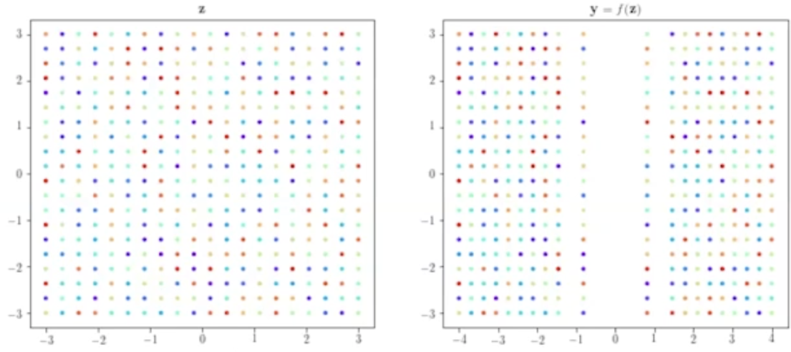

#### 1.3.2. Radial.

Похоже на rbf ядро в kernel-based методах. Просто искажает распределение как Гауссиана (
относительно какого-то центра и радиуса).

$$x = f^{-1}(z) = z + \beta h(\alpha, r)(z - z_0)$$

$$\det\frac{\partial f^{-1}(z)}{\partial z} =
(1 + \beta h(\alpha, r) + \beta h'(\alpha, r)r)\left(1 + \beta h(\alpha, r)\right)^{n-1}$$

где $z_0 \in \mathbb{R}^n, a \in \mathbb{R}^+, \beta \in \mathbb{R},
h(\alpha, r) = (\alpha + r)^{-1}$ и $r = ||z - z_0||$

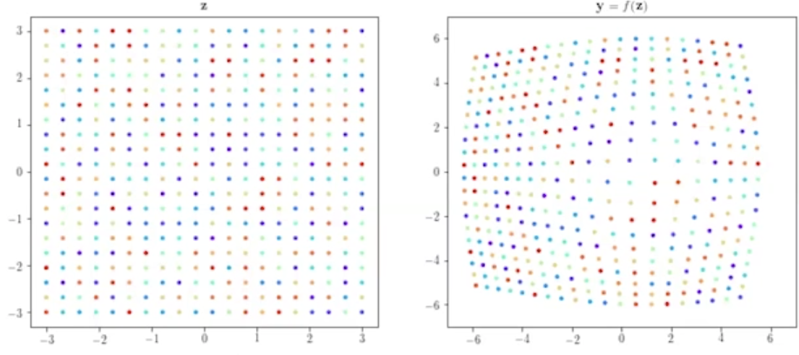

#### 1.3.3. Примеры.

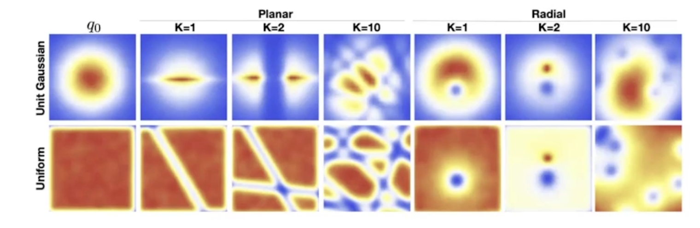

#### 1.4. Особенности.

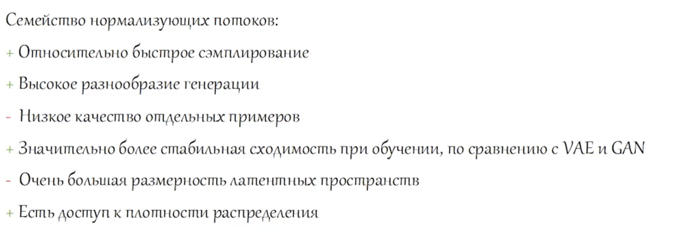

## 2. Диффузионные модели (Diffusion).

### 2.1. Интуиция.

* GAN - нестабильное обучение (слишком отдаленные распределения - проблемы с
направлением изменения)
* VAE - дают некачественные изображения из-за отсутствия точного распределения
на латентном пространстве (охватывают все, но отдельные примеры слабые)
* GAN/VAE - имеют дополнительную нейросеть для обучения
* NF - ограничены из-за свойств обратимости и требований к якобианам

Что, если мы построим итеративный процесс зашумления и де-зашумления данных? Итеративно
будем добавлять шум на картинку, и по настоящему шагу предсказывать предыдущий.

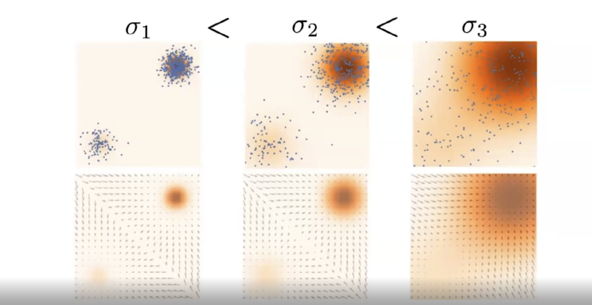

Зачем обходить проблему KL дивергенции? Раздуем, рано или поздно пересекутся.
Понятно, что шум с нулевым средним - мы не хотим смещения, только рост
дисперсии.

### 2.2. Архитектура.

Пусть $x_0 \sim p_{true}$.

$q(x_t|x_{t-1}) = x_{t-1} + \varepsilon_{t-1}|_{\varepsilon \sim шум}$ -
функция добавления шума (детерминированная схема зашумления).

$p_{\theta}(x_t|x_{t-1})$ - функция удаления шума (нейросеть).

Для каждого обьекта $x_0$ будем получать цепочку $x_1, ..., x_T$ с
помощью $q$ таким образом, чтобы $x_T \sim
\left\{\mathcal{N}(0, 1)\right\}^{data}$ - чистый Гауссовский шум.

Затем получаем цепочку обратных превращений $x'_{T-1}, ..., x'_0$.

Генерация данных - тяжеловестный процесс, нужно взять шум размера картинки
и прогнать $T$ операцию денойзинга.

Часто используют UNet-like архитектуры для построения диффузионки.

##### Формулы

$q(x_t|x_{t-1})$ - forward process или diffusion, $\beta_t$ - предопределенные
на какой-то сетке (variance schedule), $x_t$ - более зашумленный чем $x_{t-1}$:

$$q(x_t|x_{t-1}) =
\mathcal{N}(x_t | \sqrt{1 - \beta_t}\cdot x_{t-1}, \beta_t\mathbb{I})$$

где последнее - $\mathcal{N}(x_t | \mu, \sigma)$, $\beta_t$ меняется от нуля
к $1$.

$$q(x_{1:T}|x_0) = \prod_{t=1}^{T}q(x_t|x_{t-1})$$

Главное требование схемы - чтобы за $T$ шагов мы сходились к стандартному
нормальному.

##### Reparametrization Trick

Положим $\alpha_t = 1 - \beta_t$. Тогда:

$$
\begin{array}{c}
x_t & = \\
\sqrt{\alpha_t}\cdot x_{t-1} + \sqrt{1 - \alpha_t}\cdot\varepsilon_{t-1} & = \\
\sqrt{\alpha_t}\cdot
(\sqrt{\alpha_{t-1}}\cdot x_{t-2} +
\sqrt{1 - \alpha_{t-1}}\cdot\varepsilon_{t-2}) +
\sqrt{1 - \alpha_t}\cdot\varepsilon_{t-1} & = \\
\sqrt{\alpha_{t}\alpha_{t-1}}\cdot x_{t-2} +
\sqrt{1 - \alpha_t}\cdot \varepsilon_{t-1} +
\sqrt{\alpha_t}\sqrt{1 - \alpha_{t-1}}\varepsilon_{t-2} & = \\
\sqrt{\alpha_{t}\alpha_{t-1}}\cdot x_{t-2} + \varepsilon
\sqrt{1 - \alpha_t + \alpha_t - \alpha_t\alpha_{t-1}} & = \\
\mathcal{N}(\sqrt{\alpha_{t}\alpha_{t-1}}, \sqrt{1 - \alpha_{t}\alpha_{t-1}})
\end{array}$$

Положим $\tilde{\alpha}_t = \prod_{k=1}^{t}\alpha_k$, тогда:

$$x_t = \sqrt{\tilde{\alpha}_t}\cdot x_0 + \varepsilon\sqrt{1 - \tilde{\alpha}_t}$$

Следовательно:

$$q(x_t|x_0) = \mathcal{N}(x_t |
\sqrt{\tilde{\alpha}_t}\cdot x_0,
\sqrt{1 - \tilde{\alpha}_t}\cdot\mathbb{I})$$

##### Inverse Process

$q(x_{t-1}|x_t)$ - обратный процесс, неизвестен. Однако, знаем, что это гауссиана, так как
$\forall t: q(x_t), q(x_t|x_{t-1})$ - Гауссианы. Оцениваем через нейросеть:

$$p_{\theta}(x_{t-1}|x_t) = \mathcal{N}(x_{t-1} | \mu_\theta(x_t, t), \Sigma_\theta(x_t, t))$$

$$p_\theta(x_{0:T}) = p_(x_T)\prod_{t=1}^{T}p_\theta(x_{t-1}|x_t)$$

##### MLE

Работает с отдельными обьектами, не с распределением - не можем делать
MLE.

Функция ошибки - Evidence Lower Bound (ELBO) - ограничивает правдободобие:

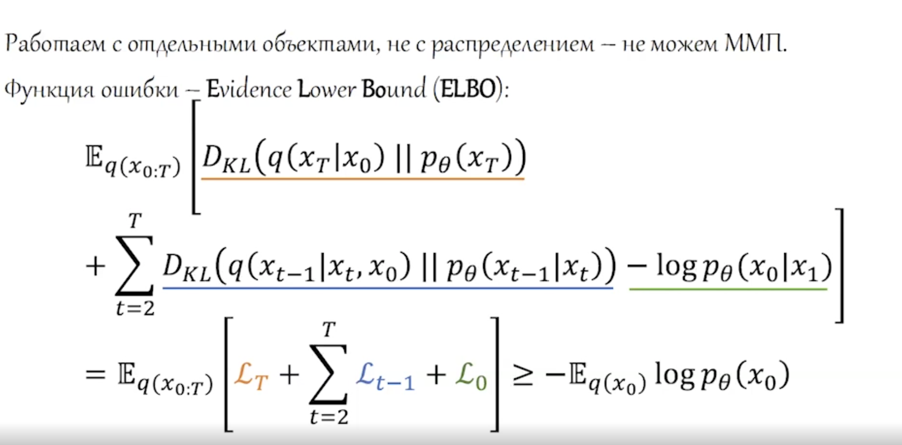

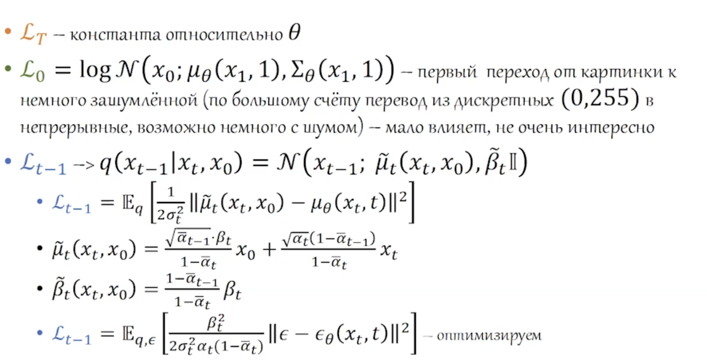

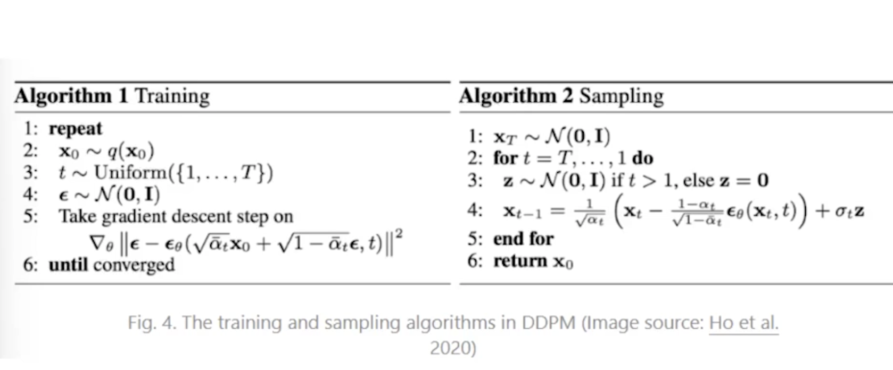

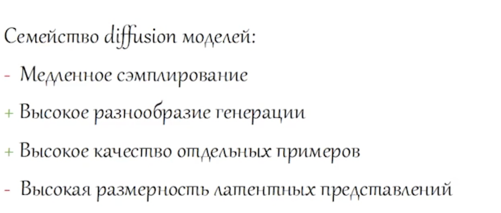

### 3. Сравнение архитектур.

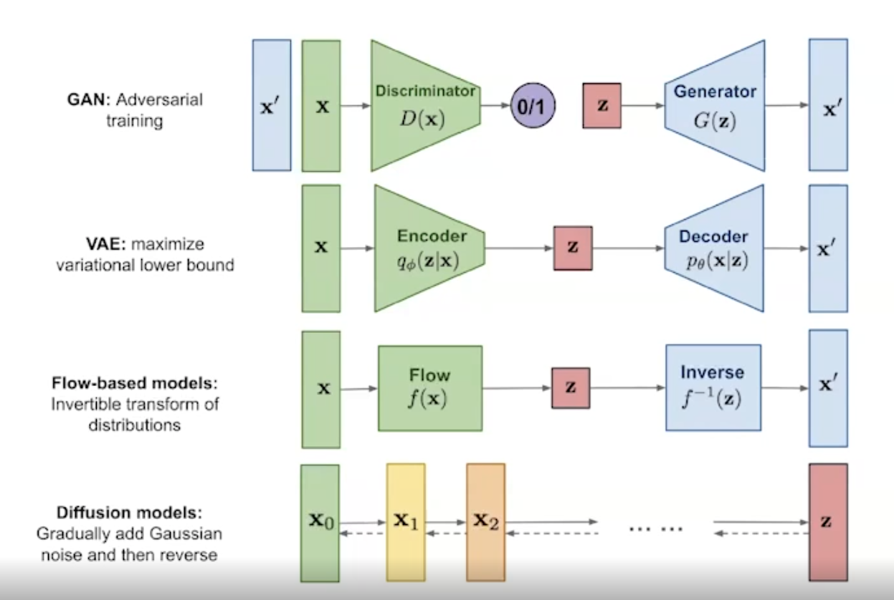

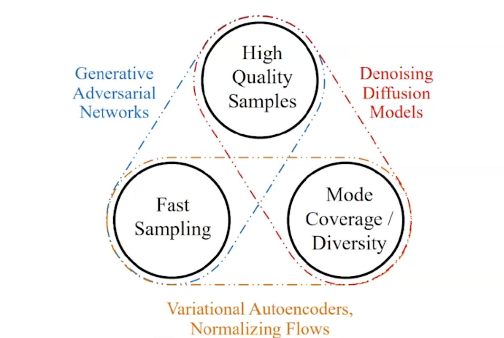

### 4. Условная генерация (Conditional Generation).

#### 4.1. Условная?

Вместо $p_{true}(x)$ будем предсказывать условное распределение $p_{true}(x|c)$.

#### 4.2. Добавление условности.

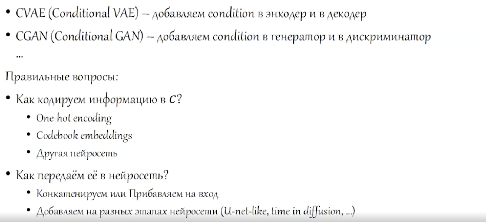

Сильный conditioning (сильный ~ много весов) может привести к mode-collapse. Например,
как говорилось на семинаре, если делать условную генерацию по классам, и желаемому классу
добавлять эмбеддинг, то при достаточно большом размере эмбеддинга модель может научиться
выдавать среднюю картинку класса по этому эмбеддингу, а основной вход игнорировать. Когда
conditioning слабый (весов мало ~ маленький эмбеддинг на класс), то запомнить в нем целую
картинку не получится, придется использовать основной вход. Поэтому, как я понял, частый
подход - подавать conditioning информацию не сразу на вход нейросети, а позже добавлять/
конкатенировать к уже какому-то слою.

Окей, ну пусть запомнила, но мы же обучаемся дальше? Так вот здесь проблема со сходимостью
появляется. Предсказать среднюю картинку класса/самую частую картинку класса не так сложно,
но чтобы выйти из такого локального минимума, нужно сразу на батче уметь неплохо генерировать
другие картинки. Скорее всего, любое движение от средней картинки будет хуже делать,
и поэтому модель обучение застопорится. Следовательно, коэффициент перед reconstruction
loss надо можно делать ощутимо больше ($0.99$ у reconstruction loss и $0.01$ у KL), чтобы можно
было выходить из таких локальных минимумов, и когда дисперсия картинок уже высокая,
снова ставить $0.5 - 0.5$ и продолжать обучение (в семинарском ноутбуке
Generative Models part 2 ровно так).
